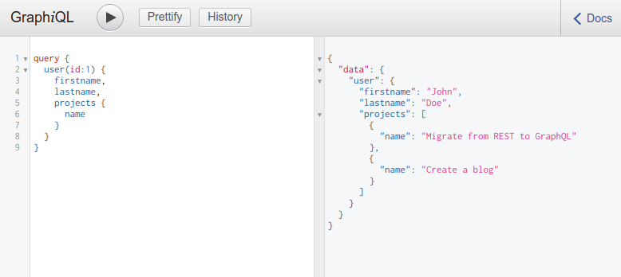

# Graphql sql mapping

Trying out graphql with this example [project](https://github.com/amaurymartiny/graphql-example)

I modified `resolvers.js` to print some info on console for each called sql query.

```js
import sequelize from '../models';

export default function resolvers () {
  const models = sequelize.models;

  return {
    RootQuery: {
      user (root, { id }, context) {
        console.log('SQL: RootQuery.user')
        const result = models.User.findByPk(id, context);
        return result
      },
      users (root, args, context) {
        console.log('SQL: RootQuery.users')
        return models.User.findAll({}, context);
      }
    },

    User: {
      projects (user) {
        console.log('SQL: User.projects')
        const result = user.getProjects();
        return result
      }
    },

    Project: {
      tasks (project) {
        console.log('SQL: Project.tasks')
        return project.getTasks();
      }
    }
  };
}
```

So everytime a sql query is called, there will be a `SQL:...` in server console.

Let's run a test query with graphiql (localhost:3000/graphiql).



Server console:

```
Express app listening on localhost:3000
...
SQL: RootQuery.user
Executing (default): SELECT `id`, `firstname`, `lastname`, `email` FROM `Users` AS `User` WHERE `User`.`id` = '1';
SQL: User.projects
Executing (default): SELECT `id`, `name`, `UserId` FROM `Projects` AS `Project` WHERE `Project`.`UserId` = 1;
```

So conclusion is that there were two queries to the database to serve this one graphql query.

How to avoid this?
